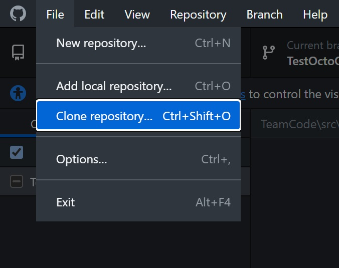
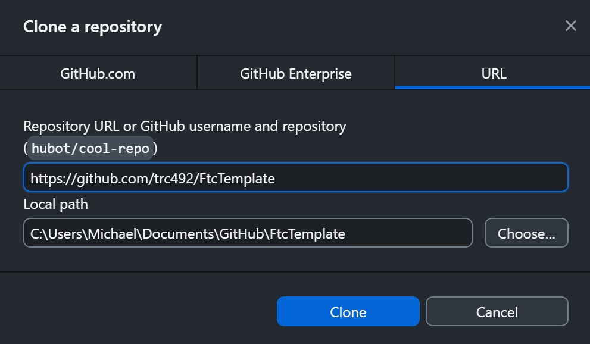

# Installing

Before you can start coding, you need to install the required software on your computer. In this section, we will talk about installing Source Control Software as well as the reqiured IDE.

## Source Control Software

We use [GitHub](https://en.wikipedia.org/wiki/GitHub) Desktop as our [source control](https://en.wikipedia.org/wiki/Source_Code_Control_System) software that stores our source code on the Internet at GitHub.com (GitHub repositories). Follow these instructions to set up and install software to access our GitHub repositories.

1. Create a GitHub account if you do not already have one ([link here](https://GitHub.com)).
2. Download and install the GitHub Desktop software from [here](https://desktop.github.com).
3. Start GitHub Desktop, click *File->Clone repository...*
 
4. Select the URL tab and enter the repository URL: *https://github.com/trc492/FtcTemplate.git*
5. Enter the local path to clone the repository into. Please note that Windows may suggest cloning into your OneDrive folder. Unless you pay for huge storage on OneDrive, we recommend you change it to your local hard drive. For example:
```
 C:\Users\<You>\Document\GitHub
```
 
6. Click the Clone button.

Congratulations! You have now successfully cloned the FtcTemplate repository.

##  Android Studio

To download and install Android Studio, go to this [website](https://developer.android.com/studio). Click the download Android Studio button and agree to their terms and conditions. Once the installer is downloaded, open it to start the installation. Generally, you can take all the default options it suggested unless you know what you are doing and want to customize the installation. Click “Finish” to start Android Studio. In the “Welcome to Android Studio” window, click the “Open” button and select the FtcTemplate folder where you cloned the GitHub repository.
